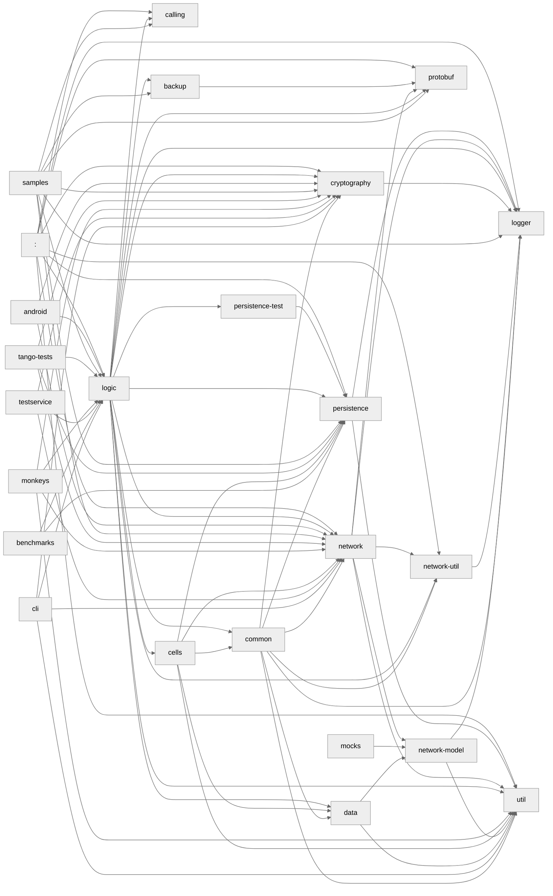

# Kalium
[](https://github.com/wireapp/kalium/actions/workflows/gradle-jvm-tests.yml)
[](https://codecov.io/gh/wireapp/kalium)

## How to build

### Dependencies

- JDK 17 (ex: openjdk-17-jdk on Ubuntu)
- [libsodium](https://github.com/jedisct1/libsodium)
- [cryptobox-c](https://github.com/wireapp/cryptobox-c)
- [cryptobox4j](https://github.com/wireapp/cryptobox4j)

### Supported Platforms

- Android (see the [Android](https://github.com/wireapp/wire-android) module)
- JVM (see the [cli](https://github.com/wireapp/kalium/tree/develop/cli) module)
- iOS (partially)
- JavaScript (just a tiny bit)

The `cli` can be executed on the terminal of any machine that 
satisfies the dependencies mentioned above, and is capable of actions like:
- Logging in
- Create a group conversation
- Add user to group conversation
- Receive and send text messages in real time
- Remove another client from your account remotely
- Refill MSL key packages

#### Building dependencies on macOS 12

Just run `make`, which will download and compile dependencies listed above from source, 
the output will be `$PROJECT_ROOT$/native/libs`

#### Running on your machine

When running any tasks that require the native libraries (`libsodium`, `cryptobox-c` 
and `cryptobox4j`), you need to pass their location as VM options like so:

```
-Djava.library.path=./path/to/native/libraries/mentioned/before
```

For example, if you want to run the task `jvmTest` and the libraries are in `./native/libs`:

```
./gradlew jvmTest -Djava.library.path=./native/libs
```

#### Running the CLI

You can see all commands and options by running `login --help`

```
Usage: cliapplication login [OPTIONS] COMMAND [ARGS]...

Options:
  -e, --email TEXT     Account email
  -p, --password TEXT  Account password
  --environment TEXT   Choose backend environment: can be production, staging
                       or an URL to a server configuration
  -h, --help           Show this message and exit

Commands:
  create-group
  listen-group
  delete-client
  add-member
  remove-member
  console
  refill-key-packages
  mark-as-read                Mark a conversation as read
  update-supported-protocols
```

##### JVM

```
./gradlew :cli:assemble
java -jar cli/build/libs/cli.jar login --email <email> --password <password> listen-group 
```

or if you want the jar file deleted after your run:

```
./gradlew :cli:run  --console=plain --quiet --args="login --email <email> --password <password> listen-group"
```

##### Native (Mac)

For running on arm64 mac
```
./gradlew :cli:macosArm64Binaries
./cli/build/bin/macosArm64/debugExecutable/cli.kexe login
```

For running on intel mac
```
./gradlew :cli:macosX64Binaries
./cli/build/bin/macosX64/debugExecutable/cli.kexe login
```

#### Detekt rules

We use and try to maintain our codestyle uniformed, so apart from having our checks in place in our
CI. You can have live feedback using the IDE, here is how:

1. IntelliJ -> Settings -> Plugins -> Marketplace -> Search and install "Detekt"
2. Settings -> Tools -> Detekt -> set: (replace $PROJECT_ROOT accordingly to your machine)

    - Configuration Files: $PROJECT_ROOT/detekt/detekt.yml
    - Baseline File: $PROJECT_ROOT/detekt/baseline.yml (optional)
    - Plugin Jars: $PROJECT_ROOT/detekt-rules/build/libs/detekt-rules.jar (this will add our custom
      rules to provide live feedback)

or

You can run locally in your terminal:

```
./gradlew clean detekt
```

#### Dependency Graph


#### Logo

The logo is adapted from [OpenMoji](https://openmoji.org/) – the open-source emoji and icon project. License: [CC BY-SA 4.0](https://creativecommons.org/licenses/by-sa/4.0/)