# MLS Flow Documentation (Android / Kalium)

This directory documents how Android currently handles MLS-related sync and recovery flows in `kalium/logic`.

The goal of this documentation is to make the Android behavior understandable to:
- other client teams,
- core-crypto engineers,
- backend engineers debugging notification / welcome / rejoin problems.

## Scope

This documentation covers:
- how MLS-specific use cases and handlers are wired,
- what each flow does on success,
- what each flow does on error,
- where Android relies on local DB state vs core-crypto vs fresh backend state,
- how incremental sync, batching, cancellation, and duplicate processing can affect MLS flows.

It does **not** try to document MLS protocol semantics in general. It documents the **Android implementation behavior**.

## Documents

- [Use Cases and Handlers](./use-cases.md)
- [Incremental Sync and Failure Semantics](./incremental-sync.md)
- [Runtime Timeline and Concurrency](./runtime-concurrency.md)
- [Duplicate Handling](./duplicate-handling.md)

## Main Entry Points

- `ConversationEventReceiver` dispatches incoming conversation events to handlers:
  - [`kalium/logic/src/commonMain/kotlin/com/wire/kalium/logic/sync/receiver/ConversationEventReceiver.kt`](../../logic/src/commonMain/kotlin/com/wire/kalium/logic/sync/receiver/ConversationEventReceiver.kt)
- `IncrementalSyncWorker` processes gathered event batches inside a crypto transaction:
  - [`kalium/logic/src/commonMain/kotlin/com/wire/kalium/logic/sync/incremental/IncrementalSyncWorker.kt`](../../logic/src/commonMain/kotlin/com/wire/kalium/logic/sync/incremental/IncrementalSyncWorker.kt)
- `SyncExecutor` starts/stops sync depending on active requesters:
  - [`kalium/logic/src/commonMain/kotlin/com/wire/kalium/logic/sync/SyncExecutor.kt`](../../logic/src/commonMain/kotlin/com/wire/kalium/logic/sync/SyncExecutor.kt)
- Android app lifecycle requests temporary sync via:
  - [`app/src/main/kotlin/com/wire/android/util/lifecycle/SyncLifecycleManager.kt`](../../../app/src/main/kotlin/com/wire/android/util/lifecycle/SyncLifecycleManager.kt)

## High-Level Runtime Flow

```mermaid
flowchart LR
    A["Push or foreground lifecycle"] --> B["SyncLifecycleManager"]
    B --> C["SyncExecutor request"]
    C --> D["Slow sync if needed"]
    D --> E["IncrementalSyncManager"]
    E --> F["EventGatherer"]
    F --> G["EventRepository observeEvents"]
    G --> H["IncrementalSyncWorker"]
    H --> I["EventProcessor / ConversationEventReceiver"]
    I --> J["MLS handlers and use cases"]
```

## Source of Truth Model

Android MLS flows currently use three different sources of truth:

1. **Core-crypto local state**
   - `conversationExists(...)`
   - `conversationEpoch(...)`
   - welcome processing / join / establish state inside MLS engine

2. **Backend current state**
   - `fetchConversation(...)`
   - `fetchGroupInfo(...)`
   - reset endpoint

3. **Persistence / DB state**
   - `Conversation.protocol.groupId`
   - `Conversation.protocol.epoch`
   - `Conversation.protocol.groupState`

A large part of MLS recovery complexity comes from these three sources becoming temporarily inconsistent.

## Current Android-Specific Safety Guards

The current branch includes these important guards:

- `IncrementalSyncWorker` finishes processing + `setEventsAsProcessed(...)` inside `NonCancellable`, reducing duplicate re-processing during sync cancellation.
- `JoinExistingMLSConversationUseCase` now syncs DB `epoch` from core-crypto when the MLS group already exists locally.
- `StaleEpochVerifier` now uses fresh backend `ConversationResponse.epoch` instead of re-reading remote epoch from local DB after fetch.
- `MLSWelcomeEventHandler` skips external-commit rejoin when `OrphanWelcome` happens but the group is already established locally.

These changes are documented in detail in the linked files above.
