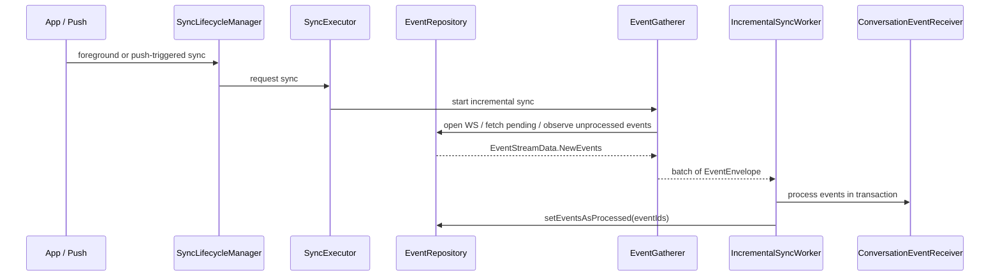

# Incremental Sync and Failure Semantics

This file documents how Android incremental sync interacts with MLS event processing.

It focuses on:
- event gathering,
- batching,
- transaction boundaries,
- cancellation,
- duplicate processing scenarios at the queue/runtime level.

Event-specific duplicate handling is documented separately in:
- [Duplicate Handling](./duplicate-handling.md)

## Main Components

- `SyncLifecycleManager`
  - Android lifecycle / notification-triggered sync requests.
  - [`app/src/main/kotlin/com/wire/android/util/lifecycle/SyncLifecycleManager.kt`](../../../app/src/main/kotlin/com/wire/android/util/lifecycle/SyncLifecycleManager.kt)
- `SyncExecutor`
  - starts and cancels sync depending on active requesters.
  - [`kalium/logic/src/commonMain/kotlin/com/wire/kalium/logic/sync/SyncExecutor.kt`](../../logic/src/commonMain/kotlin/com/wire/kalium/logic/sync/SyncExecutor.kt)
- `EventRepository`
  - websocket + pending notification ingestion and local event queue.
  - [`kalium/logic/src/commonMain/kotlin/com/wire/kalium/logic/data/event/EventRepository.kt`](../../logic/src/commonMain/kotlin/com/wire/kalium/logic/data/event/EventRepository.kt)
- `EventGatherer`
  - turns remote/local event state into `EventStreamData` batches.
  - [`kalium/logic/src/commonMain/kotlin/com/wire/kalium/logic/sync/incremental/EventGatherer.kt`](../../logic/src/commonMain/kotlin/com/wire/kalium/logic/sync/incremental/EventGatherer.kt)
- `IncrementalSyncWorker`
  - processes batches in crypto transaction and marks them processed.
  - [`kalium/logic/src/commonMain/kotlin/com/wire/kalium/logic/sync/incremental/IncrementalSyncWorker.kt`](../../logic/src/commonMain/kotlin/com/wire/kalium/logic/sync/incremental/IncrementalSyncWorker.kt)

## High-Level Sequence

## Detailed Behavior

### 1. Sync request lifecycle

`SyncExecutor` keeps sync alive as long as at least one request is active.

Important property:
- sync start/stop is driven by `subscriptionCount` on internal sync state flow.

This means sync can stop as soon as requesters disappear, including temporary push-triggered requesters.

### 2. Temporary sync requests from push / background

`SyncLifecycleManager.syncTemporarily(...)`:
- opens a sync request,
- waits until `Live` or failure,
- optionally keeps request alive for a short grace period,
- then releases request.

If nothing else keeps sync alive, this can cause sync cancellation shortly after the app becomes live.

### 3. WebSocket open behavior

When WebSocket opens, `EventRepository`:
1. sets all currently unprocessed events to `pending`,
2. if on legacy notification flow, fetches pending events from server,
3. emits `ReadyToProcess` immediately for legacy or waits for sentinel marker in async flow.

This matters because it changes the local queue even before actual event processing begins.

### 4. Event queue semantics

`observeEvents()` emits local unprocessed events in batches.

Important detail:
- `lastEmittedEventId` is **in-memory only**.
- If the observer restarts, it is reset to `null`.

Consequence:
- restart of gather/observe logic can re-emit already seen but not-yet-processed events.

### 5. Pending/live merge behavior

When pending notifications are fetched:
- Android deletes unprocessed **live** events with the same event ids,
- then inserts pending versions.

Relevant code:
- `deleteUnprocessedLiveEventsByIds(...)`
- followed by `insertEvents(...)`

Consequence:
- the same `eventId` can appear again from a different source representation,
- logs around the same logical event may show different `timestampIso` if payload mapping or timing differs.

## Processing Transaction Semantics

`IncrementalSyncWorker` currently does this per batch:

1. collect a `NewEvents` batch from `EventGatherer`,
2. enter `withContext(NonCancellable)`,
3. open crypto transaction `processEvents`,
4. process envelopes one by one,
5. flush pending side effects,
6. after transaction success, mark all returned event ids as processed.

### Important current guarantee

The worker now wraps the whole batch processing and `setEventsAsProcessed(...)` path in `NonCancellable`.

Practical effect:
- if sync cancellation happens because requesters disappear,
- the current batch is still allowed to finish and mark events as processed.

This directly reduces duplicate event handling during sync restart.

## What can still go wrong

Even with `NonCancellable`, duplicate or repeated handling is still possible in some scenarios.

### Scenario A: process death / app kill

If the process dies before the event is marked processed, local DB still contains an unprocessed event.

Result:
- after restart, the same event may be processed again.

### Scenario B: crash after partial side effects

If the handler performed side effects before the batch finishes and the process crashes before `setEventsAsProcessed(...)`, the event may be replayed.

Result:
- side effects may need to be idempotent.

### Scenario C: observer restart + in-memory dedup reset

`lastEmittedEventId` is not persisted.

Result:
- restarting `observeEvents()` can re-emit the same unprocessed event list.

### Scenario D: pending/live merge reintroduces same event id

If a live event was already inserted locally but still unprocessed, and then pending fetch returns the same event id:
- unprocessed live event is deleted,
- pending event is inserted.

Result:
- same logical event id may enter processing again from a different local row/source combination.

## Why the same MLS event could be processed twice

The observed Android MLS welcome issue is explained by this interaction:

1. event inserted from WebSocket,
2. batch processing starts,
3. sync requester count drops to zero and sync is restarted,
4. pending fetch inserts event list again,
5. the same event id becomes visible again in a new batch.

Historically, if cancellation hit before `setEventsAsProcessed(...)`, the event remained unprocessed and could be replayed.

The current `NonCancellable` change reduces this specific window substantially.

## MLS-Specific Consequences of Incremental Sync Issues

Queue/runtime replay affects MLS handlers differently depending on event type.

For handler-specific outcomes, see:
- [Duplicate Handling](./duplicate-handling.md)

## Batch Transaction Guarantees and Gaps

### Guaranteed today

- event batch processing runs in one crypto transaction,
- pending side effects are flushed before marking processed,
- current batch is shielded from coroutine cancellation by `NonCancellable`.

### Not guaranteed today

- exactly-once processing across process death,
- exactly-once side effects across crash boundaries,
- stable event queue ordering across WS/pending merge and sync restarts,
- fully consistent DB state vs core-crypto state at every step.

## Cross-Platform Review Questions

These are the most useful questions for other client teams / core-crypto reviewers:

1. Which handlers are truly idempotent if the same event id is processed twice?
2. Which side effects happen before `setEventsAsProcessed(...)` and therefore can be replayed?
3. Do other platforms persist an equivalent of `lastEmittedEventId`, or do they rely on pure DB processed flags?
4. Should `setEventsAsProcessed(...)` eventually move inside the same durable unit as side effects, or is Android's current split acceptable?
5. Which MLS/core-crypto failures are safe to treat as duplicate/no-op vs requiring rejoin/reset?

## Current Android Position

The current implementation is intentionally pragmatic:
- reduce duplicate processing during normal coroutine cancellation,
- prefer core-crypto over DB where local MLS state exists,
- prefer fresh backend response over DB where remote epoch is needed,
- still tolerate that some crash/restart scenarios can replay events.

That is not a formal exactly-once guarantee. It is a best-effort model with MLS-specific guards on top.
