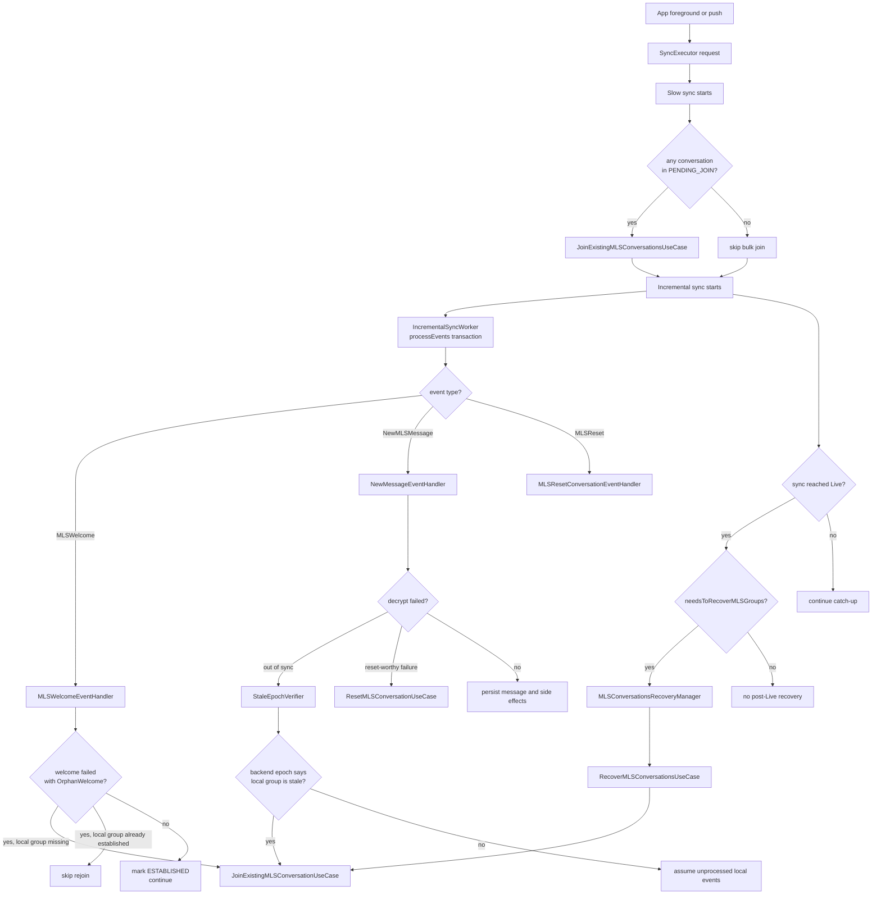
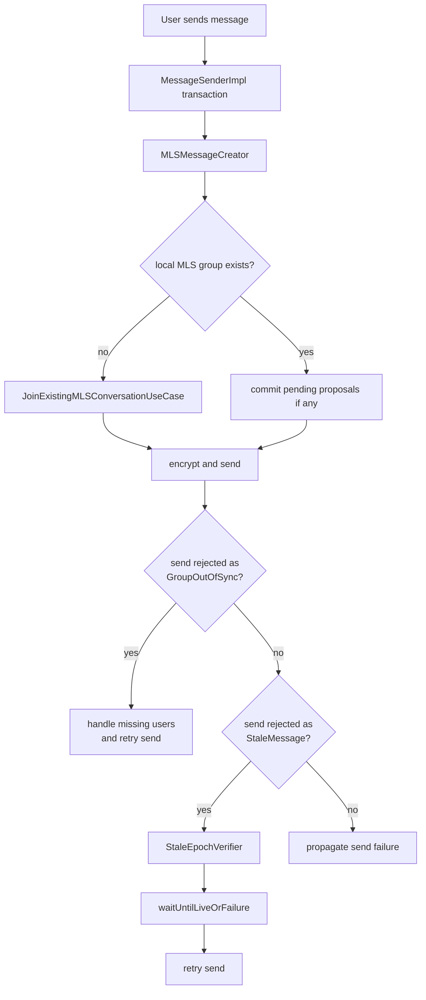
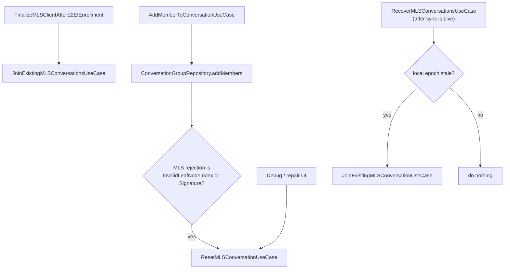

# MLS Runtime Timeline and Concurrency

This file documents when MLS-related Android use cases are started during normal app runtime, which ones run inside incremental sync, and where race conditions or state drift are still possible.

It is intentionally implementation-focused. The goal is to answer:
- when a given MLS use case starts,
- whether it runs inside the incremental sync processing transaction,
- whether another MLS use case can run at the same time,
- what is protected by crypto transaction serialization,
- what can still drift despite that serialization.

Event-specific duplicate handling is documented separately in:
- [Duplicate Handling](./duplicate-handling.md)

## Runtime Overview

### 1. Sync path

### 2. Send path

### 3. Foreground recovery and mutation path

## Main Execution Contexts

### 1. Slow sync phase

Before incremental sync starts, slow sync can trigger MLS-related work:

- `JoinExistingMLSConversationsUseCase`
  - used for conversations in `PENDING_JOIN`
  - source:
    - [`../../logic/src/commonMain/kotlin/com/wire/kalium/logic/sync/slow/SlowSyncWorker.kt`](../../logic/src/commonMain/kotlin/com/wire/kalium/logic/sync/slow/SlowSyncWorker.kt)
    - [`../../logic/src/commonMain/kotlin/com/wire/kalium/logic/data/conversation/JoinExistingMLSConversationsUseCase.kt`](../../logic/src/commonMain/kotlin/com/wire/kalium/logic/data/conversation/JoinExistingMLSConversationsUseCase.kt)

- `OneOnOneResolver.resolveAllOneOnOneConversations(...)`
  - may indirectly enter MLS establish / rejoin decisions
  - same slow-sync step area as above

Properties:
- runs before incremental sync batch processing starts,
- still uses `CryptoTransactionProvider`,
- can mutate MLS state before event stream replay begins.

### 2. Incremental sync event processing phase

This is the most important MLS runtime path.

`IncrementalSyncWorker`:
- gathers unprocessed event batches from `EventGatherer`,
- opens crypto transaction `processEvents`,
- dispatches events through `ConversationEventReceiver`,
- flushes pending side effects,
- only then marks event ids as processed.

Source:
- [`../../logic/src/commonMain/kotlin/com/wire/kalium/logic/sync/incremental/IncrementalSyncWorker.kt`](../../logic/src/commonMain/kotlin/com/wire/kalium/logic/sync/incremental/IncrementalSyncWorker.kt)
- [`../../logic/src/commonMain/kotlin/com/wire/kalium/logic/sync/receiver/ConversationEventReceiver.kt`](../../logic/src/commonMain/kotlin/com/wire/kalium/logic/sync/receiver/ConversationEventReceiver.kt)

MLS-related handlers running inside this transaction:
- `MLSWelcomeEventHandler`
- `NewMessageEventHandler`
- `MLSResetConversationEventHandler`
- `ProtocolUpdateEventHandler` for protocol changes

Important consequence:
- if one of these handlers calls another MLS use case, that nested call happens in the same transaction context unless the nested use case opens a fresh top-level transaction on its own.

### 3. Post-live recovery phase

After incremental sync becomes `Live`, `MLSConversationsRecoveryManager` may trigger:
- `RecoverMLSConversationsUseCase`

Source:
- [`../../logic/src/commonMain/kotlin/com/wire/kalium/logic/feature/conversation/MLSConversationsRecoveryManager.kt`](../../logic/src/commonMain/kotlin/com/wire/kalium/logic/feature/conversation/MLSConversationsRecoveryManager.kt)
- [`../../logic/src/commonMain/kotlin/com/wire/kalium/logic/feature/conversation/RecoverMLSConversationsUseCase.kt`](../../logic/src/commonMain/kotlin/com/wire/kalium/logic/feature/conversation/RecoverMLSConversationsUseCase.kt)

Properties:
- intentionally delayed until incremental sync is `Live`,
- reduces overlap with catch-up event processing,
- still runs in its own crypto transaction,
- can call `JoinExistingMLSConversationUseCase`.

### 4. User / foreground / debug initiated phase

These do not depend on incremental sync event processing and can be triggered by user behavior or explicit repair tools:

- `MessageSenderImpl`
  - sending MLS messages
  - `MLSMessageCreator` may call `JoinExistingMLSConversationUseCase` if the local group does not exist yet
  - on `StaleMessage` send rejection it calls `StaleEpochVerifier`, which may then rejoin
  - source: [`../../logic/src/commonMain/kotlin/com/wire/kalium/logic/feature/message/MessageSenderImpl.kt`](../../logic/src/commonMain/kotlin/com/wire/kalium/logic/feature/message/MessageSenderImpl.kt)
  - source: [`../../logic/src/commonMain/kotlin/com/wire/kalium/logic/feature/message/MLSMessageCreator.kt`](../../logic/src/commonMain/kotlin/com/wire/kalium/logic/feature/message/MLSMessageCreator.kt)
- `AddMemberToConversationUseCase`
  - add-member flow for existing conversation
  - on selected MLS rejection failures it escalates to `ResetMLSConversationUseCase`
  - source: [`../../logic/src/commonMain/kotlin/com/wire/kalium/logic/feature/conversation/AddMemberToConversationUseCase.kt`](../../logic/src/commonMain/kotlin/com/wire/kalium/logic/feature/conversation/AddMemberToConversationUseCase.kt)
- `FinalizeMLSClientAfterE2EIEnrollment`
  - after enrollment completion, triggers `JoinExistingMLSConversationsUseCase`
  - source: [`../../logic/src/commonMain/kotlin/com/wire/kalium/logic/feature/client/FinalizeMLSClientAfterE2EIEnrollment.kt`](../../logic/src/commonMain/kotlin/com/wire/kalium/logic/feature/client/FinalizeMLSClientAfterE2EIEnrollment.kt)
- `ResetMLSConversationUseCase`
  - explicit repair/reset path
  - source: [`../../logic/src/commonMain/kotlin/com/wire/kalium/logic/data/conversation/ResetMLSConversationUseCase.kt`](../../logic/src/commonMain/kotlin/com/wire/kalium/logic/data/conversation/ResetMLSConversationUseCase.kt)
- debug / repair helpers using their own transaction
- enrollment/finalization flows that bulk-join MLS conversations

Properties:
- can happen while sync is active,
- use the same `CryptoTransactionProvider`,
- therefore crypto mutations serialize,
- but they can still observe stale DB/backend state between transactions.

## Send-Time Guarantees and Non-Guarantees

This section is important because send behavior is easy to misunderstand.

### What Android does guarantee today

When an MLS send fails with `StaleMessage`:
- Android runs `StaleEpochVerifier`,
- then waits for `syncManager.waitUntilLiveOrFailure()`,
- then retries the send.

Source:
- [`../../logic/src/commonMain/kotlin/com/wire/kalium/logic/feature/message/MessageSenderImpl.kt`](../../logic/src/commonMain/kotlin/com/wire/kalium/logic/feature/message/MessageSenderImpl.kt)

So Android does have a recovery step that says:
- once we know the send was stale,
- do not retry immediately,
- wait until sync reports `Live`,
- only then retry.

### What Android does not guarantee today

Android does **not** require `Live` before the **first** MLS send attempt.

That means the first send can happen while:
- incremental sync is still catching up,
- local queued MLS commits have not all been processed yet,
- local DB metadata may still lag behind core-crypto,
- backend and local snapshots are still converging.

### Practical interpretation

The current send path is:

1. try to send with current local state,
2. if stale is detected, verify and recover,
3. wait for `Live`,
4. retry.

This is a pragmatic model, not a strict “only send after full catch-up” model.

### What this protects against

- retrying too early after a known stale failure,
- repeatedly sending while sync is obviously behind,
- missing the chance to recover via stale-epoch verification before retry.

### What this still leaves open

- the first attempt may still use outdated MLS state,
- the real cause may be:
  - genuinely missing commits on the local client,
  - or simply queued events/commits not yet processed,
- `Live` is only a sync-state checkpoint, not a global guarantee that no further relevant MLS event can arrive immediately after.

### Product implication

If someone asks whether Android guarantees “we only send when fully caught up”, the answer is:

- **No for the first attempt**
- **Mostly yes for retry after stale detection**

That distinction matters when reasoning about race conditions with incremental sync.

## MLS Use Cases by Trigger

| Use case / handler | Typical trigger | Inside incremental sync transaction | Can also run outside sync | Notes |
|---|---|---|---|---|
| `MLSWelcomeEventHandler` | `Conversation.MLSWelcome` event | Yes | No | event-driven only |
| `NewMessageEventHandler` | `Conversation.NewMLSMessage` event | Yes | No | may trigger stale/recovery logic |
| `StaleEpochVerifier` | MLS decrypt resolved as out-of-sync | Yes, when called from `NewMessageEventHandler` | Potentially yes if reused elsewhere later | compares local core-crypto vs fresh backend |
| `JoinExistingMLSConversationUseCase` | orphan welcome recovery, stale recovery, explicit join, send flow, one-on-one resolver | Often yes | Yes | central decision point for join vs establish |
| `JoinExistingMLSConversationsUseCase` | slow sync, enrollment finalization | No | Yes | opens its own top-level transaction |
| `RecoverMLSConversationsUseCase` | post-sync `Live` recovery | No | Yes | delayed by `MLSConversationsRecoveryManager` |
| `ResetMLSConversationUseCase` | reset-worthy MLS failure | Sometimes yes | Yes | can be nested inside sync event processing or used directly |
| `MLSMessageCreator` | send path before encrypting MLS message | No | Yes | may call `JoinExistingMLSConversationUseCase` if local group does not exist |
| `AddMemberToConversationUseCase` | user adds members to conversation | No | Yes | can trigger `ResetMLSConversationUseCase` after selected MLS message rejections |
| `MLSResetConversationEventHandler` | `Conversation.MLSReset` event | Yes | No | updates local metadata after reset event |

## What Transaction Serialization Actually Protects

`CryptoTransactionProvider` serializes access through:
- `proteus.transaction(...)`
- `mls.transaction(...)`
- combined `transaction(...)`

Source:
- [`../../logic/src/commonMain/kotlin/com/wire/kalium/logic/data/client/CryptoTransactionProvider.kt`](../../logic/src/commonMain/kotlin/com/wire/kalium/logic/data/client/CryptoTransactionProvider.kt)

This is strong protection for:
- two MLS mutations trying to hit core-crypto at the same time,
- nested MLS operations during one event batch,
- send flow colliding with sync flow at the exact crypto mutation point.

In practice, this means:
- `MLSWelcomeEventHandler` and `MessageSenderImpl` should not mutate the same MLS client truly concurrently,
- `JoinExistingMLSConversationUseCase` called from sync and `ResetMLSConversationUseCase` called from debug should serialize at transaction level,
- one transaction will wait for the other rather than executing core-crypto mutations in parallel.

## What Transaction Serialization Does Not Protect

This is the important part. The transaction does **not** make the whole MLS flow globally race-free.

It does **not** protect against:

### 1. DB vs core-crypto drift

Example:
- transaction A establishes or joins locally,
- DB metadata is only partially updated,
- transaction B starts later and reads stale `groupState` / `epoch` from persistence.

Current known examples:
- `JoinExistingMLSConversationUseCase` still uses DB `epoch != 0` when local group does not exist.
- `RecoverMLSConversationsUseCase` still compares local core-crypto state against epoch loaded from persistence.

### 2. Backend vs local drift

Example:
- transaction A fetches remote conversation/group info,
- before transaction B uses its own fetched metadata, remote state changes,
- both transactions are locally serialized but reason over different snapshots.

Current known examples:
- stale join retry path,
- reset flow after refetch,
- stale epoch verification using fresh backend metadata while other local handlers may still process old queued events.

### 3. Event queue replay

The event queue lives outside the crypto transaction.

`EventRepository.observeEvents()` keeps `lastEmittedEventId` only in memory.
If event observation restarts, previously emitted but not yet processed events can be emitted again.

Source:
- [`../../logic/src/commonMain/kotlin/com/wire/kalium/logic/data/event/EventRepository.kt`](../../logic/src/commonMain/kotlin/com/wire/kalium/logic/data/event/EventRepository.kt)

This is exactly why the same logical MLS event can be handled more than once.

### 4. Side effects outside core-crypto state

Some side effects are logically downstream of decryption/processing but not part of the crypto transaction boundary:
- system messages,
- delivery confirmations,
- self-deletion scheduling,
- logging,
- UI-observed DB state changes.

If the process dies at the wrong moment, replay can happen even if crypto mutation serialization itself was correct.

### 5. Sync cancellation / restart orchestration

`SyncExecutor` starts and stops sync based on active requesters.
Temporary requesters from lifecycle or push can disappear while current work is in progress.

Source:
- [`../../logic/src/commonMain/kotlin/com/wire/kalium/logic/sync/SyncExecutor.kt`](../../logic/src/commonMain/kotlin/com/wire/kalium/logic/sync/SyncExecutor.kt)
- [`../../../app/src/main/kotlin/com/wire/android/util/lifecycle/SyncLifecycleManager.kt`](../../../app/src/main/kotlin/com/wire/android/util/lifecycle/SyncLifecycleManager.kt)

Current mitigation:
- `IncrementalSyncWorker` finishes the current batch in `NonCancellable`.

But this still does not guarantee:
- exactly-once processing across process death,
- exactly-once side effects,
- no re-emission after observer restart.

## Concrete Race / Drift Scenarios

### Scenario A: same MLS event replay after sync restart

Timeline:
1. event inserted from WebSocket,
2. incremental sync starts processing batch,
3. sync requester disappears,
4. sync restarts and pending/live merge rebuilds local event queue,
5. same event id is observed again.

Transaction result:
- crypto mutations are serialized,
- but duplicate logical processing can still happen if event replay occurs.

### Scenario B: send flow vs stale recovery

Timeline:
1. user sends message,
2. `MessageSenderImpl` opens transaction,
3. `MLSMessageCreator` may first trigger `JoinExistingMLSConversationUseCase` if the local group does not exist,
4. send can fail with `StaleMessage` and call `StaleEpochVerifier`,
5. incremental sync may also process MLS events for the same conversation around the same time,
6. verifier may rejoin or repair.

Transaction result:
- core-crypto mutation is serialized,
- but the send flow may have already reasoned from metadata that becomes stale by the time recovery runs.

Potential symptom:
- send failure classified differently than expected,
- message retry / reset path triggered after local state changed.

Important nuance:
- Android does **not** require the client to already be `Live` before the first MLS send attempt.
- The send path waits for `Live` only after a `StaleMessage` rejection and only before the retry.
- This means the first send attempt can still happen while incremental sync has not yet processed all queued commits/events.

Code path:
- [`../../logic/src/commonMain/kotlin/com/wire/kalium/logic/feature/message/MessageSenderImpl.kt`](../../logic/src/commonMain/kotlin/com/wire/kalium/logic/feature/message/MessageSenderImpl.kt)

Practical consequence:
- if local MLS state is outdated because commits have not been processed yet, the first send can legitimately fail,
- Android then tries to recover by:
  - running `StaleEpochVerifier`,
  - waiting until sync is `Live`,
  - retrying the send once it believes catch-up is complete.

What this protects against:
- retrying immediately while sync is still clearly behind.

What this does **not** guarantee:
- that the first attempt always had the latest commits,
- that `Live` means no further relevant MLS event can still arrive immediately after,
- that the stale cause was definitely “remote missing commits” rather than “queued local events not yet applied”.

### Scenario C: add-members flow vs sync-driven repair

Timeline:
1. user runs `AddMemberToConversationUseCase`,
2. server rejects MLS message with `InvalidLeafNodeIndex` or `InvalidLeafNodeSignature`,
3. add-members flow triggers `ResetMLSConversationUseCase`,
4. incremental sync may also still process queued MLS events for the same conversation.

Transaction result:
- crypto mutation is serialized,
- but queued event processing and add-members UI flow can still reason from different DB/backend snapshots.

Potential symptom:
- add-members appears to fail or partially recover,
- conversation state flips through reset/re-establish while sync still catches up.

### Scenario D: recovery manager vs newly processed events

Timeline:
1. incremental sync becomes `Live`,
2. `MLSConversationsRecoveryManager` starts recovery transaction,
3. new live MLS events arrive immediately after `Live`,
4. recovery and subsequent event processing use different local/remote snapshots.

Mitigation:
- manager waits for `Live`, which is better than running during catch-up.

Remaining issue:
- `Live` is not a global quiescent point. It only means current queue caught up once.

### Scenario E: reset fallback using stale DB epoch

Timeline:
1. local MLS group is missing,
2. `ResetMLSConversationUseCase` cannot read epoch from core-crypto,
3. it falls back to DB epoch,
4. backend reset is executed with that fallback epoch.

Transaction result:
- transaction is serialized,
- but correctness still depends on persistence freshness.

### Scenario F: recover-established flow using stale DB epoch

Timeline:
1. conversation is marked `ESTABLISHED` in DB,
2. local epoch changed earlier or DB update lagged,
3. `RecoverMLSConversationsUseCase` compares core-crypto against persistence epoch,
4. it may classify stale/non-stale incorrectly.

This is not a transaction race.
It is a source-of-truth problem.

## Practical Conclusions

### Safe assumptions

- MLS crypto mutations are not expected to run in parallel against core-crypto if they all go through `CryptoTransactionProvider`.
- Event handlers inside one incremental sync batch behave as one serialized crypto-processing unit.
- post-live recovery is less likely to fight with catch-up processing because it starts only after `Live`.

### Unsafe assumptions

- `Live` does not mean no further MLS event can arrive while recovery runs.
- DB `epoch` / `groupState` are not guaranteed to be perfectly synchronized with local core-crypto state.
- event processing is not exactly-once across restart/crash boundaries.
- transaction boundaries do not make backend snapshots and DB snapshots atomic with crypto state.

## Where I Would Still Look for State Drift

These are the highest-value areas to keep reviewing:

1. `JoinExistingMLSConversationUseCase`
   - branch on DB `epoch`
   - source: [`../../logic/src/commonMain/kotlin/com/wire/kalium/logic/data/conversation/JoinExistingMLSConversationUseCase.kt`](../../logic/src/commonMain/kotlin/com/wire/kalium/logic/data/conversation/JoinExistingMLSConversationUseCase.kt)

2. `RecoverMLSConversationsUseCase`
   - stale comparison against DB epoch
   - source: [`../../logic/src/commonMain/kotlin/com/wire/kalium/logic/feature/conversation/RecoverMLSConversationsUseCase.kt`](../../logic/src/commonMain/kotlin/com/wire/kalium/logic/feature/conversation/RecoverMLSConversationsUseCase.kt)

3. `ResetMLSConversationUseCase`
   - DB epoch fallback when local group is missing
   - source: [`../../logic/src/commonMain/kotlin/com/wire/kalium/logic/data/conversation/ResetMLSConversationUseCase.kt`](../../logic/src/commonMain/kotlin/com/wire/kalium/logic/data/conversation/ResetMLSConversationUseCase.kt)

4. `EventRepository.observeEvents()`
   - in-memory dedup only
   - source: [`../../logic/src/commonMain/kotlin/com/wire/kalium/logic/data/event/EventRepository.kt`](../../logic/src/commonMain/kotlin/com/wire/kalium/logic/data/event/EventRepository.kt)

5. `IncrementalSyncWorker`
   - batch processing vs side effects vs mark-processed boundary
   - source: [`../../logic/src/commonMain/kotlin/com/wire/kalium/logic/sync/incremental/IncrementalSyncWorker.kt`](../../logic/src/commonMain/kotlin/com/wire/kalium/logic/sync/incremental/IncrementalSyncWorker.kt)

## Review Questions for Other Platforms and Core-Crypto

1. Do other platforms have an equivalent of `post-Live recovery`, and if yes, do they treat `Live` as sufficient isolation from incremental event processing?
2. Which MLS flows are expected to be idempotent if replayed after restart or crash?
3. Do other platforms rely on DB `epoch` for `join vs establish` or only for diagnostics?
4. If local MLS group is missing, what is the preferred source of truth for recovery:
   - backend,
   - DB,
   - or “hard fail and refetch everything”?
5. Should recovery flows that use backend snapshots be considered authoritative over local persistence even if sync is still active?
